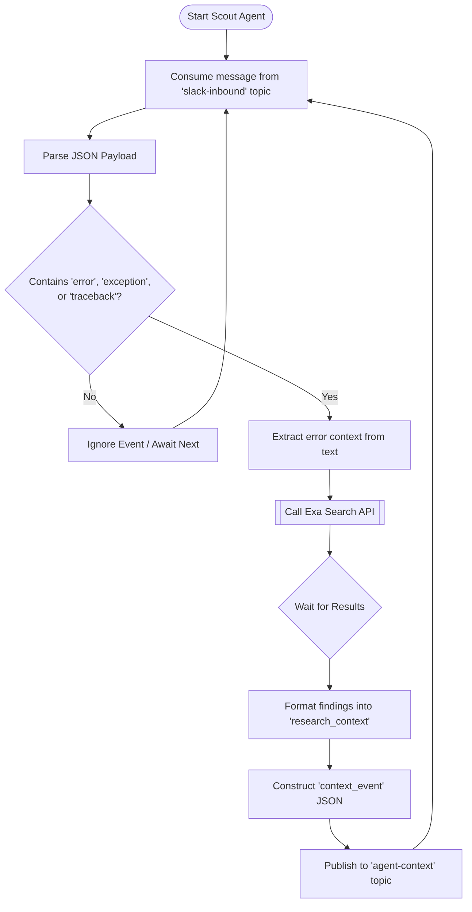
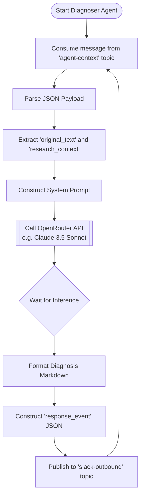
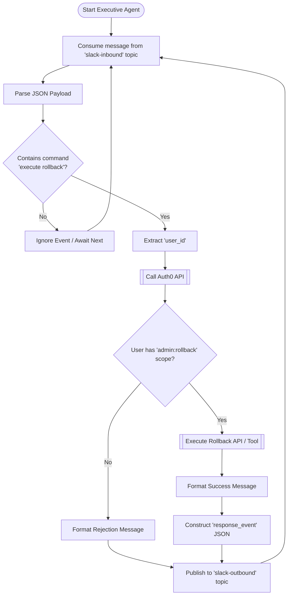

# Agent Workflows & Event Contracts

In an event-driven architecture, the logic of individual microservices (agents) and the shape of the data they pass (the event contracts) are the most critical pieces of documentation. 

Below are the detailed internal flow diagrams for each of the three AI agents, followed by the Kafka Topic Event Contracts.

---

## 1. Scout Agent (The Researcher)

The Scout Agent acts as an ambient listener. It uses a lightweight heuristic to decide if a message warrants expensive web/doc research via the Exa API, reducing unnecessary API calls and noise.



---

## 2. Diagnoser Agent (The Brain)

The Diagnoser Agent is strictly triggered by context events. It offloads the "searching" to the Scout, acting solely as a synthesizer. It leverages high-end LLMs via OpenRouter to read the raw error alongside the Exa research, generating actionable advice.



---

## 3. Executive Agent (The Actor)

The Executive Agent listens directly to the human conversation for explicit commands. Because it has the ability to mutate state (e.g., reverting a deployment), it enforces a strict authorization gate using Auth0 before calling any tools.



---

## 4. Event Stream Contracts (Data Dictionary)

In an event-driven Multi-Agent System, the agents are entirely decoupled. They don't know *who* is reading their data. Therefore, the JSON schemas flowing through Kafka act as the strict API contracts.

### Topic: `slack-inbound`
**Produced by:** Slack Gateway
**Consumed by:** Scout Agent, Executive Agent
**Description:** Represents a raw message posted by a human in the Slack War Room.
```json
{
  "channel_id": "C12345678",
  "user_id": "U98765432",
  "text": "We just got an exception: Auth0 unauthorized audience error on the prod server.",
  "is_mention": false
}
```

### Topic: `agent-context`
**Produced by:** Scout Agent
**Consumed by:** Diagnoser Agent
**Description:** Contains enriched background research related to a specific human message.
```json
{
  "channel_id": "C12345678",
  "original_text": "We just got an exception: Auth0 unauthorized audience error on the prod server.",
  "research_context": "Exa Search Result: This typically indicates a misconfigured Auth0 audience in the production environment variables.",
  "source": "exa_scout"
}
```

### Topic: `slack-outbound`
**Produced by:** Diagnoser Agent, Executive Agent
**Consumed by:** Slack Gateway
**Description:** Actionable responses, alerts, or tool-execution summaries to be posted back to the human engineers.
```json
{
  "channel_id": "C12345678",
  "text": ":white_check_mark: *Executive Action Confirmed*\nUser <@U98765432> authorized via Auth0.\nResult: Rollback successful. Deployment reverted to previous stable state."
}
```
