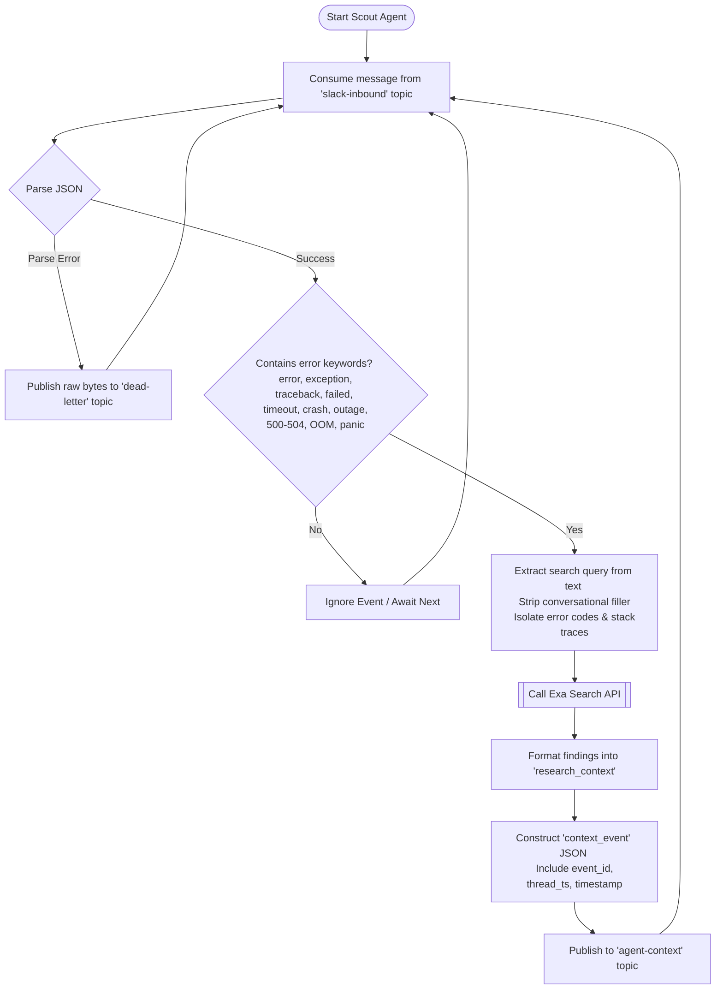
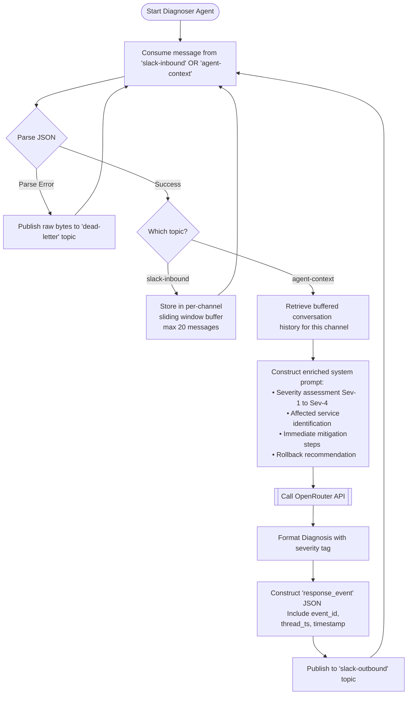
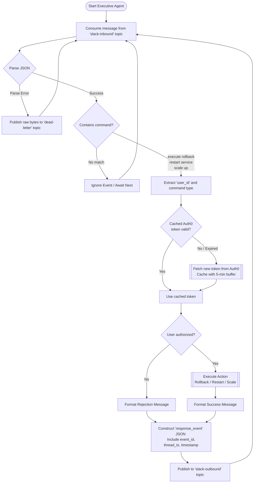
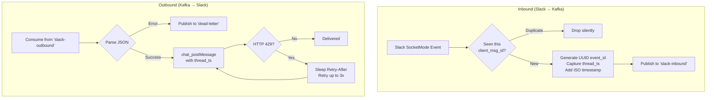

# Agent Workflows & Event Contracts

In an event-driven architecture, the logic of individual microservices (agents) and the shape of the data they pass (the event contracts) are the most critical pieces of documentation.

Below are the detailed internal flow diagrams for each of the three AI agents, followed by the Kafka Topic Event Contracts.

---

## 1. Scout Agent (The Researcher)

The Scout Agent acts as an ambient listener. It uses keyword extraction to isolate error signatures from conversational noise before querying Exa, reducing unnecessary API calls and improving search quality.



---

## 2. Diagnoser Agent (The Brain)

The Diagnoser subscribes to **both** `slack-inbound` and `agent-context`. It maintains a sliding window of recent channel messages so the LLM has full conversation history when synthesizing a diagnosis, not just a single error line.



---

## 3. Executive Agent (The Actor)

The Executive Agent listens for explicit action commands. It enforces a strict Auth0 authorization gate with **token caching** (tokens are cached for 24 hours with a 5-minute safety buffer) and supports multiple commands.



---

## 4. Slack Gateway (The Bridge)

The Gateway bridges Slack and Kafka with production-grade reliability features.



---

## 5. Event Stream Contracts (Data Dictionary)

### Topic: `slack-inbound`
**Produced by:** Slack Gateway
**Consumed by:** Scout Agent, Diagnoser Agent, Executive Agent
```json
{
  "event_id": "a1b2c3d4-e5f6-7890-abcd-ef1234567890",
  "channel_id": "C12345678",
  "user_id": "U98765432",
  "text": "We just got an exception: Auth0 unauthorized audience error on the prod server.",
  "thread_ts": "1726182000.000100",
  "timestamp": "2026-09-12T17:18:10Z",
  "is_mention": false
}
```

### Topic: `agent-context`
**Produced by:** Scout Agent
**Consumed by:** Diagnoser Agent
```json
{
  "event_id": "a1b2c3d4-e5f6-7890-abcd-ef1234567890",
  "channel_id": "C12345678",
  "thread_ts": "1726182000.000100",
  "timestamp": "2026-09-12T17:18:12Z",
  "original_text": "Auth0 unauthorized audience error on the prod server",
  "research_context": "Exa Search Results: ...",
  "source": "exa_scout"
}
```

### Topic: `slack-outbound`
**Produced by:** Diagnoser Agent, Executive Agent
**Consumed by:** Slack Gateway
```json
{
  "event_id": "a1b2c3d4-e5f6-7890-abcd-ef1234567890",
  "channel_id": "C12345678",
  "thread_ts": "1726182000.000100",
  "text": ":mag: *AI Diagnosis* (Sev-1)\n..."
}
```

### Topic: `dead-letter`
**Produced by:** Any agent on JSON parse failure
**Consumed by:** Ops/Debug tooling
```
Raw bytes of the unparseable message for inspection.
```
