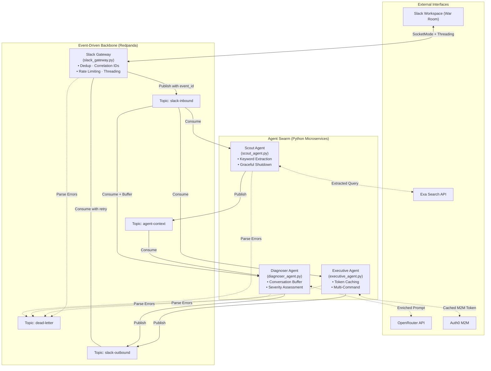
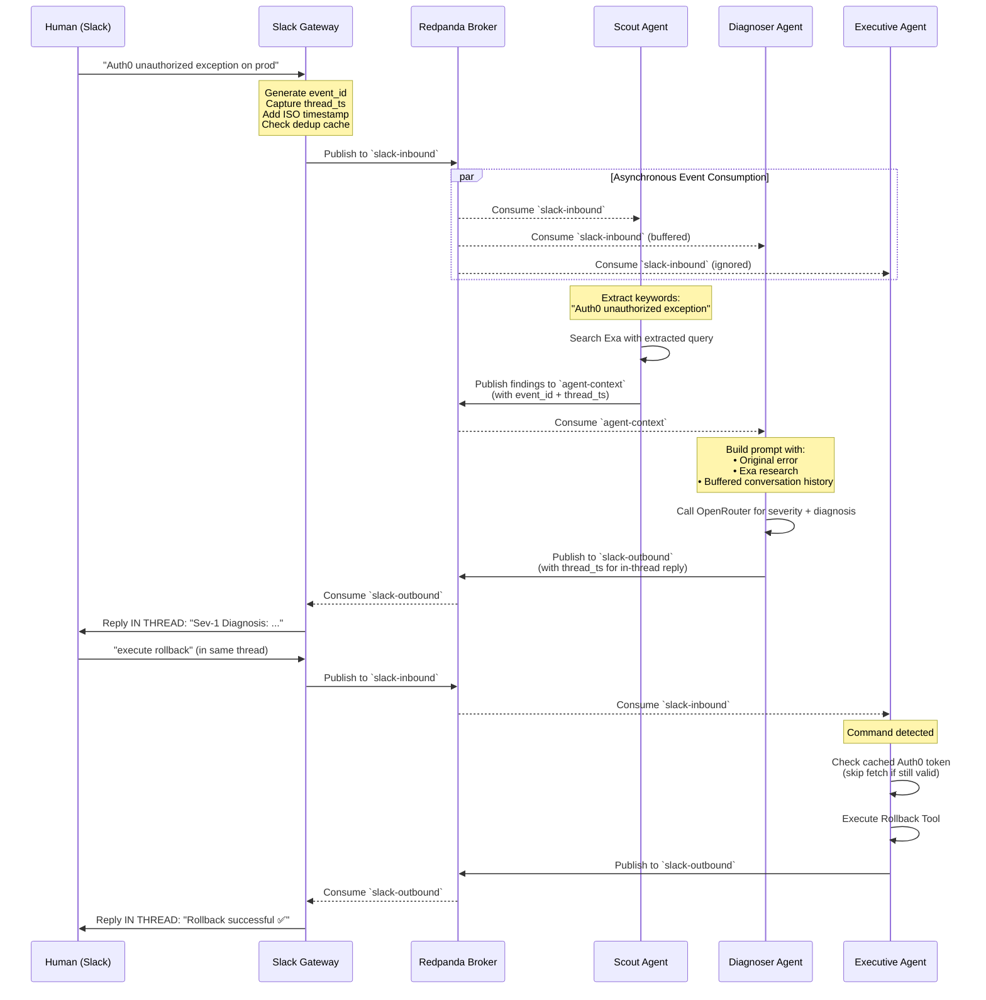
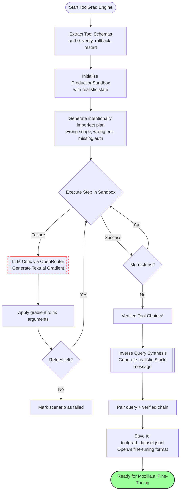
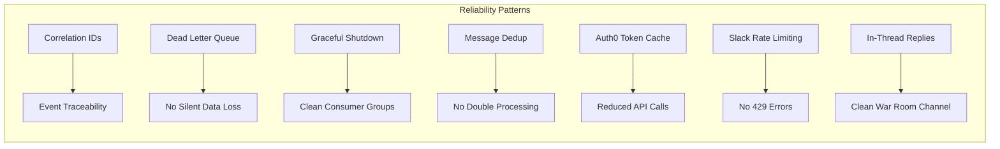

# The Event-Driven War Room Architecture

This document outlines the system architecture and event-driven data flow, demonstrating the principles from the **Confluent "Guide to Event-Driven Design for Agents"** and the **ToolGrad Google Research** paper.

## 1. System Architecture (The Blackboard Pattern)

Instead of agents communicating via rigid, synchronous API calls, this system uses the **Blackboard Pattern**. The Redpanda (Kafka) broker acts as the central "Blackboard" where agents publish and subscribe to events asynchronously. 

## 2. Event Sequence Diagram (Incident Resolution)

This sequence diagram illustrates how the loosely coupled agents interact during a Sev-1 outage. All responses are posted **in-thread** to keep the main channel clean.

## 3. ToolGrad Data Generation Flow

The **Executive Agent** possesses dangerous capabilities. To ensure reliability, we implement the **ToolGrad** methodology with a real stateful sandbox, textual gradient optimization loop, and inverse query synthesis.

## 4. Production Reliability Features

