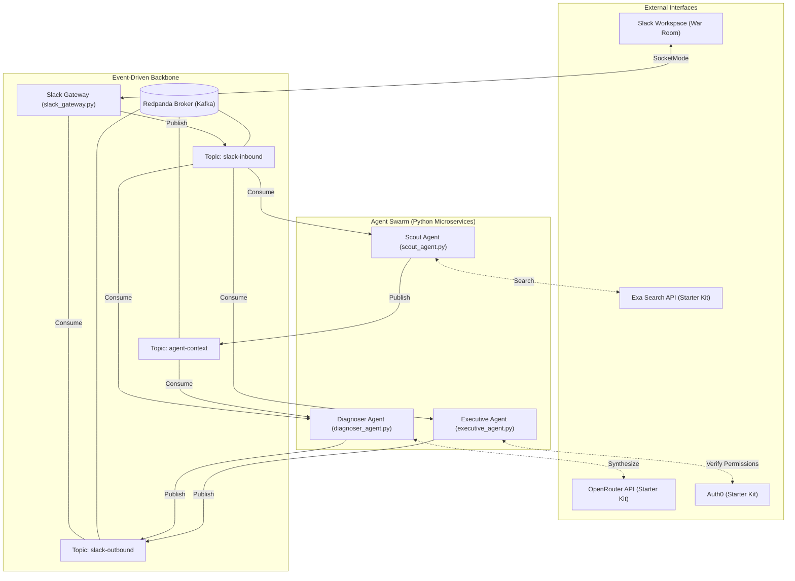
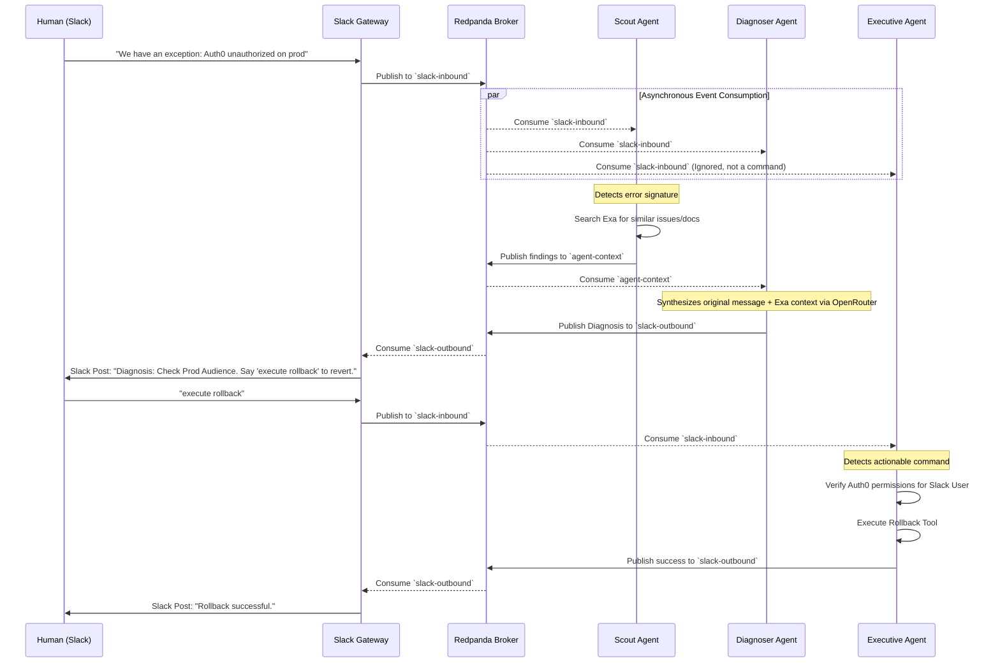

# The Event-Driven War Room Architecture

This document outlines the system architecture and event-driven data flow, demonstrating the principles from the **Confluent "Guide to Event-Driven Design for Agents"** and the **ToolGrad Google Research** paper.

## 1. System Architecture (The Blackboard Pattern)

Instead of agents communicating via rigid, synchronous API calls, this system uses the **Blackboard Pattern**. The Redpanda (Kafka) broker acts as the central "Blackboard" where agents publish and subscribe to events asynchronously. 



## 2. Event Sequence Diagram (Incident Resolution)

This sequence diagram illustrates how the loosely coupled agents interact during a Sev-1 outage. Notice how the Scout and Diagnoser agents act autonomously based on the event stream without requiring explicit `@mentions` from the human engineers.



## 3. ToolGrad Data Generation Flow

The **Executive Agent** possesses dangerous capabilities (like rolling back a production server). To ensure it is reliable, we implement the methodology from the **ToolGrad** Google Research paper. 

Rather than hoping the agent figures out the tool, we generate a dataset of 100% successful, verified tool-execution chains *first*, and then map them to synthetic queries. This dataset can be used to fine-tune a private local model (e.g., via Mozilla.ai llamafile) specifically for the Executive Agent.

```mermaid
flowchart TD
    Start([Start Dataset Generation]) --> A[Extract Tool Schemas <br> e.g. RollbackAPI, Auth0Verify]
    A --> B{Textual Gradients via LLM}
    B --> C[Execute Tool Chain (Answer First)]
    C -->|Failure| B
    C -->|Success| D[Generate Synthetic User Query <br> e.g. 'Rollback prod server']
    D --> E[Pair Query with Successful Tool Chain]
    E --> F[Save to toolgrad_dataset.jsonl]
    F --> G([Ready for Mozilla.ai Fine-Tuning])

    style B stroke:#f66,stroke-width:2px,stroke-dasharray: 5 5
    style G fill:#9f9,stroke:#333,stroke-width:2px
```
